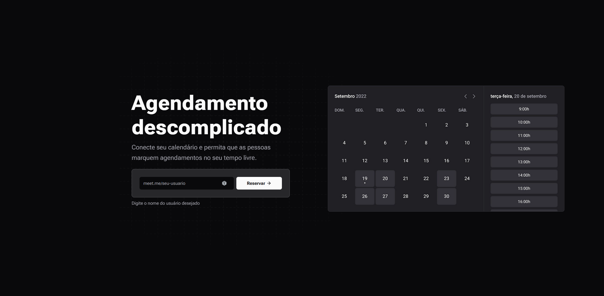

# Meet Me

This project is part of a course of Rocketseat called "Ignite Call" that aims to teach how
to create a appointment application that integrates with google calendar.



## How to initialize this project

First install all dependencies, then run the development server:

```bash
npm run dev
# or
yarn dev
# or
pnpm dev
# or
bun dev
```

Open [http://localhost:3000](http://localhost:3000) with your browser to see the result.

## Technologies

- Next.js
- Typescript
- TailwindCSS
- Shadcn/ui
- React Hook Form
- Zod
- Next-Auth

## Features

- Google Calendar Integration
- Create profile
- Create appointment with google calendar
- List available appointments

## Roadmap

- [x] Create profile
- [x] Add Google Calendar Integration
- [x] Create appointment with google calendar
- [x] Create appointments availability
- [x] List available appointments
- [x] Add appointment to google calendar
- [x] Use Next-Auth beta
- [x] Add theme switcher
- [x] Use Next-Auth provided Prisma adapter
- [x] Add custom time picker
- [ ] Add edit profile feature
- [ ] Add delete profile feature
- [ ] Use Drizzle instead of Prisma
- [ ] Use Server Components to all non-form components
- [ ] Add tests

## License

This project is under the MIT license. See the [LICENSE](./LICENSE) file for more details.

## Authors

- [Fabio Beutler](https://github.com/fabio-beutler)
